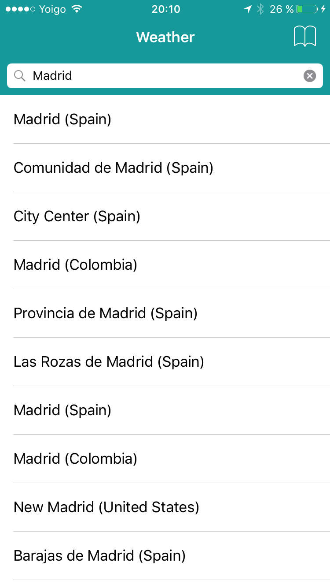
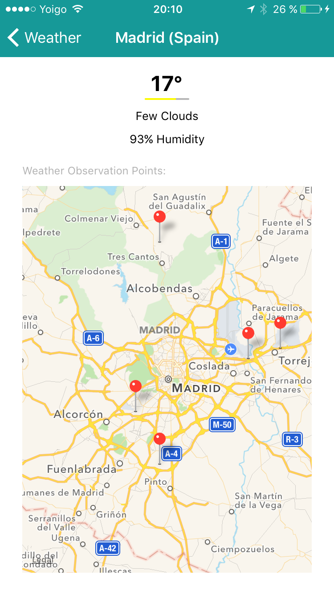

# Talento Mobile

## by Alberto Ortega Sánchez @aortegas

### Weather
Is a simple proyect that uses Weather API, to get geographic and weather information in an area.

### Resources
Developed with Xcode, Objective-C. 

### ScreenShots

##### First Screen (Search Cities, places)

##### Second Screen (Weather data detail)

##### Third Screen (Previous searches)

